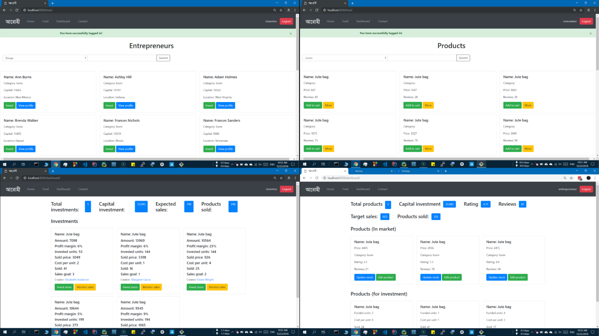
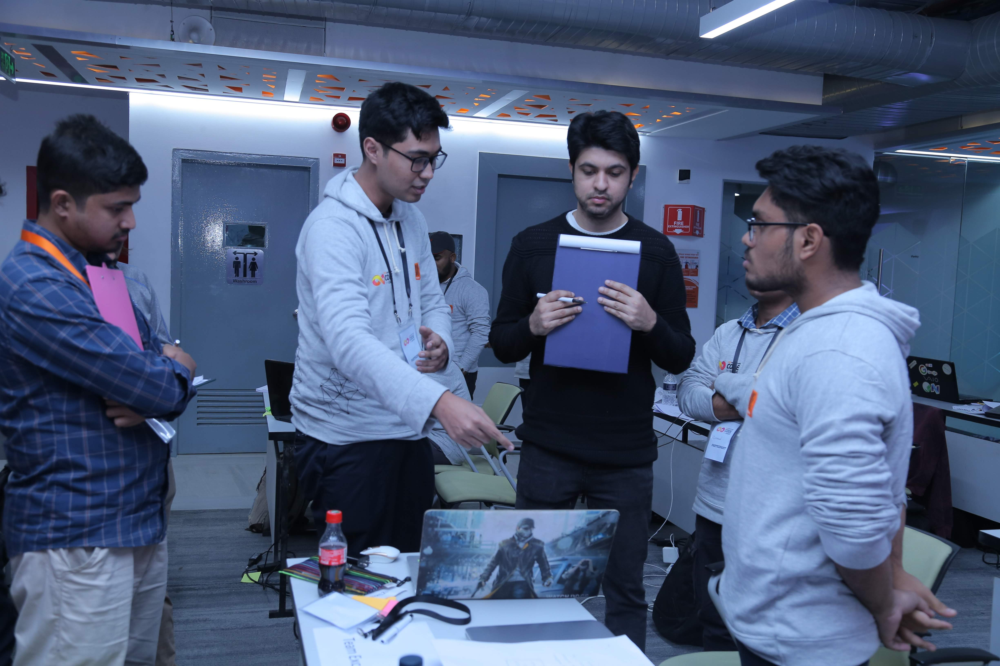
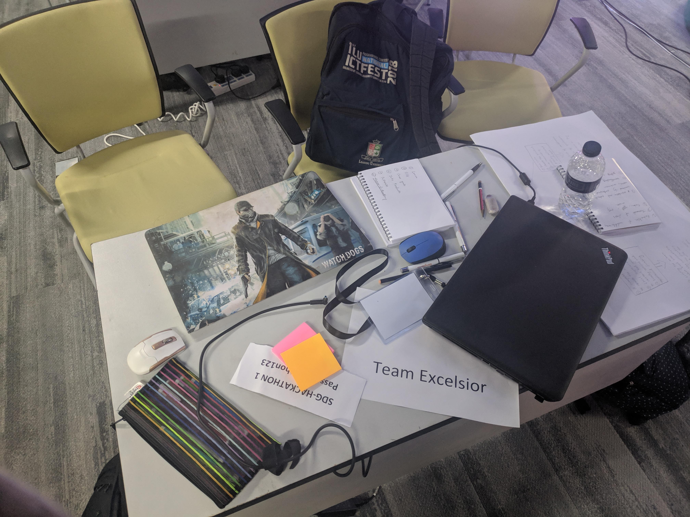
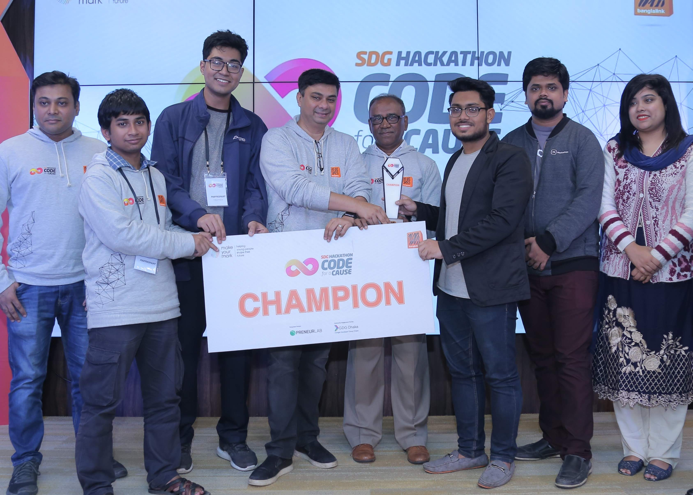

# আরোহী

A project built during Banglalink SDGHackathon 2018 to promote rural women empowerment and micro-investing, and create a direct to consumer marketplace for rural women.

### Team
- [Tahmeed Tarek](https://github.com/tahmeed156)
- [Zunaed Karim Sifat](https://github.com/ZunaedSifat/)
- [Imtiaz Ibne Azad](https://www.linkedin.com/in/imtiaz-ibne-azad/)

### Tech Stack
Python, Django, MySQL, Bootstrap-4

